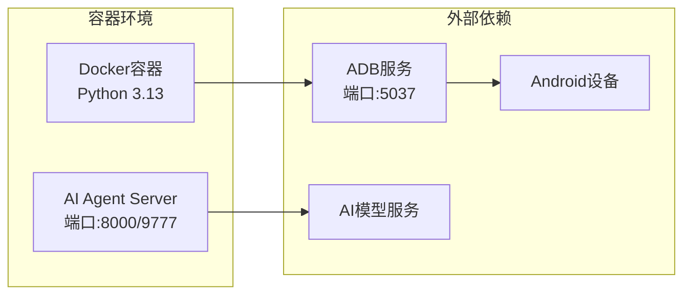

# AI Agent Server 系统架构分析

## 项目概述

这是一个基于FastAPI的AI移动设备自动化代理服务器，提供两个版本的移动设备控制引擎（V1和V4），支持通过自然语言指令控制Android设备执行各种操作。

## 系统架构图

```mermaid
graph TB
    %% 用户层
    subgraph "用户层"
        User[用户/客户端]
    end

    %% API网关层
    subgraph "API网关层"
        FastAPI[FastAPI服务器<br/>main.py<br/>端口:9777]
    end

    %% 业务逻辑层
    subgraph "业务逻辑层"
        subgraph "API端点"
            RunAgent["/run-agent<br/>同步执行V1"]
            RunAgentAsync["/run-agent-async<br/>异步执行V1"]
            RunAgentV4["/run-agent-v4<br/>同步执行V4"]
            RunAgentV4Async["/run-agent-v4-async<br/>异步执行V4"]
            CallbackTest["/callback-test<br/>回调测试端点"]
        end
        
        subgraph "后台任务处理"
            BackgroundV1[execute_agent_with_callback<br/>V1后台任务执行器]
            BackgroundV4[execute_agent_v4_with_callback<br/>V4后台任务执行器]
            CallbackSender[send_callback<br/>回调发送器]
        end
    end

    %% 核心引擎层
    subgraph "核心引擎层"
        subgraph "V1引擎 (agent_core.py)"
            AgentCoreV1[run_mobile_agent<br/>V1核心执行器]
            DeviceConnV1[get_device<br/>ADB设备连接]
            ScreenCaptureV1[capture_screenshot<br/>屏幕截图]
            SystemMsgV1[build_system_messages<br/>系统消息构建]
            ActionExecV1[execute_*<br/>动作执行器集合]
        end
        
        subgraph "V4引擎 (agent_core_v4.py)"
            AgentCoreV4[MobileAgentV4Runner<br/>V4运行器]
            AgentCoreV4Async[run_mobile_agent_v4_async<br/>V4异步执行器]
            SimpleEnv[SimpleAdbEnv<br/>简化ADB环境]
        end
    end

    %% 智能体层
    subgraph "智能体层 (V4多智能体架构)"
        InfoPool[InfoPool<br/>信息池<br/>状态管理]
        
        subgraph "智能体组件"
            Manager[Manager<br/>任务规划智能体]
            Executor[Executor<br/>动作执行智能体]
            Reflector[ActionReflector<br/>动作反思智能体]
            Notetaker[Notetaker<br/>记录智能体]
        end
        
        MobileAgentV4[MobileAgentV4_Optimized<br/>V4优化版智能体]
    end

    %% 工具层
    subgraph "工具层"
        subgraph "设备控制工具"
            MobileUse[MobileUse<br/>移动设备控制工具]
            ComputerUse[ComputerUse<br/>计算机控制工具]
        end
        
        subgraph "动作定义"
            JSONAction[JSONAction<br/>标准化动作格式]
            ActionConverter[动作转换器<br/>格式转换]
        end
        
        subgraph "工具函数"
            ImageUtils[图像处理工具<br/>截图/调整大小]
            CommonUtils[通用工具<br/>消息转换/解析]
            FileUtils[文件工具<br/>文件操作]
            ContactUtils[联系人工具<br/>联系人管理]
        end
    end

    %% 外部服务层
    subgraph "外部服务层"
        subgraph "AI模型服务"
            OpenAIAPI[OpenAI API<br/>或兼容API]
            VLLMAPI[vLLM API<br/>本地部署模型]
        end
        
        subgraph "设备连接"
            ADBDevice[ADB设备<br/>Android设备]
        end
        
        subgraph "回调服务"
            CallbackURL[回调URL<br/>外部回调接收端]
        end
    end

    %% 数据存储层
    subgraph "数据存储层"
        subgraph "内存存储"
            CallbackLogs[CALLBACK_LOGS<br/>回调日志内存存储]
            TaskLock[task_execution_lock<br/>任务执行锁]
        end
        
        subgraph "文件存储"
            AgentOutputs[agent_outputs/<br/>智能体输出目录]
            Screenshots[截图文件<br/>临时存储]
            ActionLogs[动作日志<br/>执行记录]
        end
    end

    %% 连接关系
    User --> FastAPI
    
    FastAPI --> RunAgent
    FastAPI --> RunAgentAsync
    FastAPI --> RunAgentV4
    FastAPI --> RunAgentV4Async
    FastAPI --> CallbackTest
    
    RunAgent --> AgentCoreV1
    RunAgentAsync --> BackgroundV1
    RunAgentV4 --> AgentCoreV4
    RunAgentV4Async --> BackgroundV4
    
    BackgroundV1 --> AgentCoreV1
    BackgroundV4 --> AgentCoreV4Async
    BackgroundV1 --> CallbackSender
    BackgroundV4 --> CallbackSender
    
    AgentCoreV1 --> DeviceConnV1
    AgentCoreV1 --> ScreenCaptureV1
    AgentCoreV1 --> SystemMsgV1
    AgentCoreV1 --> ActionExecV1
    
    AgentCoreV4 --> SimpleEnv
    AgentCoreV4Async --> AgentCoreV4
    
    MobileAgentV4 --> InfoPool
    MobileAgentV4 --> Manager
    MobileAgentV4 --> Executor
    MobileAgentV4 --> Reflector
    MobileAgentV4 --> Notetaker
    
    AgentCoreV1 --> MobileUse
    ActionExecV1 --> ADBDevice
    SimpleEnv --> ADBDevice
    
    Manager --> OpenAIAPI
    Executor --> OpenAIAPI
    Reflector --> OpenAIAPI
    Notetaker --> OpenAIAPI
    SystemMsgV1 --> OpenAIAPI
    
    CallbackSender --> CallbackURL
    
    ScreenCaptureV1 --> Screenshots
    MobileAgentV4 --> AgentOutputs
    CallbackTest --> CallbackLogs
    
    %% 样式定义
    classDef apiEndpoint fill:#f9f,stroke:#333,stroke-width:2px
    classDef coreEngine fill:#bbf,stroke:#33f,stroke-width:1px
    classDef agent fill:#bfb,stroke:#3a3,stroke-width:1px
    classDef tool fill:#ffb,stroke:#fa3,stroke-width:1px
    classDef external fill:#fbb,stroke:#f33,stroke-width:1px
    classDef storage fill:#ddd,stroke:#666,stroke-width:1px
    
    class RunAgent,RunAgentAsync,RunAgentV4,RunAgentV4Async,CallbackTest apiEndpoint
    class AgentCoreV1,AgentCoreV4,AgentCoreV4Async,MobileAgentV4 coreEngine
    class Manager,Executor,Reflector,Notetaker,InfoPool agent
    class MobileUse,ComputerUse,JSONAction,ImageUtils,CommonUtils,FileUtils,ContactUtils tool
    class OpenAIAPI,VLLMAPI,ADBDevice,CallbackURL external
    class CallbackLogs,TaskLock,AgentOutputs,Screenshots,ActionLogs storage
```

## 核心组件说明

### 1. API网关层
- **FastAPI服务器**: 基于FastAPI框架的Web服务器，监听9777端口
- **路由管理**: 提供RESTful API接口，支持同步和异步执行模式

### 2. 双引擎架构

#### V1引擎 (agent_core.py)
- **特点**: 简单直接的单智能体架构
- **适用场景**: 基础的移动设备控制任务
- **核心流程**: 截图 → 构建提示 → 调用API → 解析动作 → 执行动作

#### V4引擎 (agent_core_v4.py)
- **特点**: 多智能体协作架构，更智能和可靠
- **适用场景**: 复杂的移动设备自动化任务
- **核心组件**:
  - **Manager**: 任务规划和高级决策
  - **Executor**: 具体动作执行和低级操作
  - **ActionReflector**: 动作结果反思和错误处理
  - **Notetaker**: 重要信息记录和知识积累

### 3. 设备控制层
- **ADB连接**: 通过Android Debug Bridge连接和控制Android设备
- **动作执行**: 支持点击、滑动、输入、按键等各种操作
- **屏幕截图**: 实时获取设备屏幕状态

### 4. AI模型集成
- **OpenAI API**: 支持GPT-4V等多模态大语言模型
- **本地部署**: 支持vLLM等本地部署的模型服务
- **多模态处理**: 结合图像和文本进行智能决策

### 5. 异步处理机制
- **后台任务**: 支持异步执行长时间运行的自动化任务
- **回调机制**: 任务完成后自动回调指定URL
- **状态管理**: 防止并发执行冲突的任务锁机制

## 技术特点

1. **模块化设计**: 清晰的分层架构，便于维护和扩展
2. **双引擎支持**: V1简单直接，V4智能协作
3. **异步处理**: 支持长时间运行的自动化任务
4. **多模态AI**: 结合视觉和语言理解能力
5. **标准化接口**: RESTful API设计，易于集成
6. **容器化部署**: 支持Docker容器化部署

## 部署架构

这个系统架构提供了一个完整的AI驱动的移动设备自动化解决方案，能够理解自然语言指令并在Android设备上执行相应的操作。